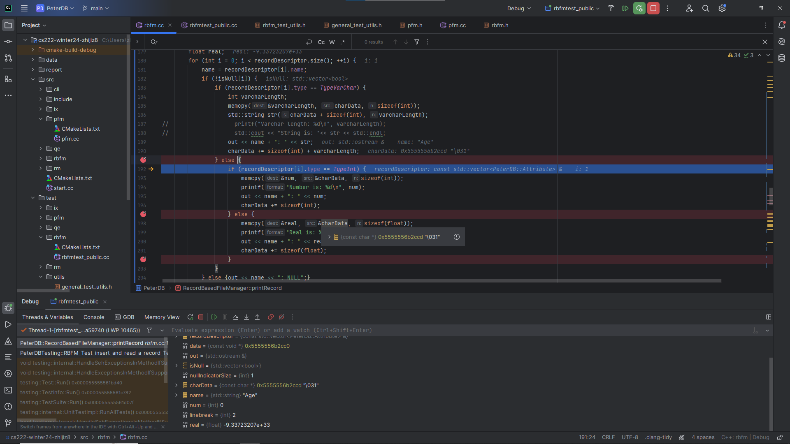
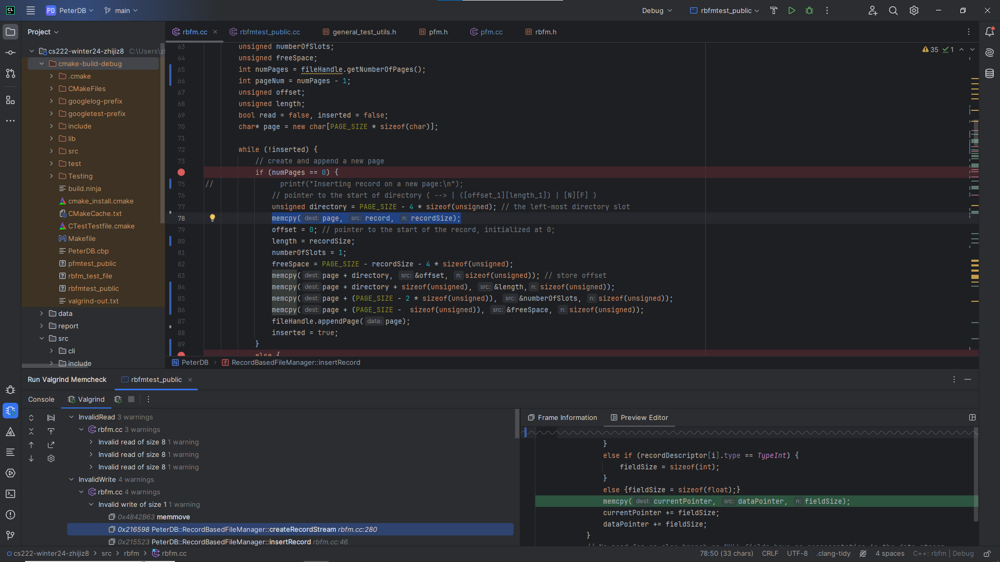

## Debugger and Valgrind Report

### 1. Basic information
 - Team #: 7
 - Github Repo Link: https://github.com/zhijiz8/cs222-winter24-zhijiz8
 - Student 1 UCI NetID: zhijiz8
 - Student 1 Name: Jason Zheng

### 2. Using a Debugger
I found setting breakpoints in Clion debugger very helpful when my program was not getting the desired value.
One example would be when I was debugging my printRecord function. I kept getting nonsense values when reading
the attribute from the data stream even though I thought I was correctly copying them from the array.

After setting breakpoints to see what my values are at each critical step, I realized that I have been copying
at the right position, except from the wrong address (I used &charData, address of the pointer, as opposed to `data`
itself)

### 3. Using Valgrind

Valgrind was exceptionally helpful when my program would crash due to segmentation error.

Valgrind would show whether if I had any misallocated or unfreed arrays. Also with insertRecord function, Valgrind showed
invalid read and invalid write warnings for other functions insertRecord uses and it led to places I wouldn't consider
before to start debugging for errors.